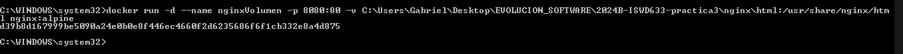
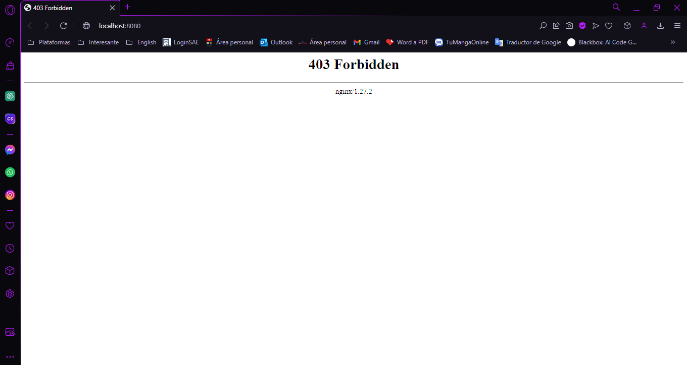
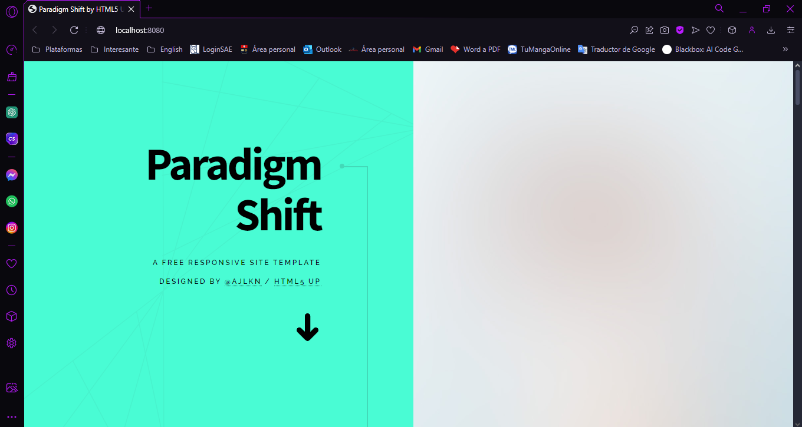
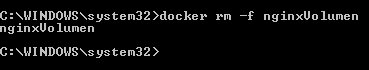

# VOLUMEN TIPO HOST
Un volumen host (o bind mount) es un tipo de volumen donde se monta un directorio o archivo específico del sistema de archivos del host en un contenedor.

```
docker run -d --name <nombre contenedor> -v <ruta carpeta host>:<ruta carpeta contenedor> <imagen> 
```
### En tu computador crear una carpeta llamada nginx y dentro de esta carpeta crea otra llamada html. Como se aprecia en la figura.


### Crear un volumen tipo host con la imagen nginx:alpine, mapear todos por puertos, para la ruta carpeta host colocar el directorio en donde se encuentra la carpeta html en tu computador y para la ruta carpeta contenedor: /usr/share/nginx/html (esta ruta se obtiene al revisar la documentación de la imagen)


```
docker run -d --name nginxVolumen -p 8080:80 -v C:\Users\Gabriel\Desktop\EVOLUCION_SOFTWARE\2024B-ISWD633-practica3\nginx\html:/usr/share/nginx/html nginx:alpine 
```


### ¿Qué sucede al ingresar al servidor de nginx?
Al ingresar al servidor de nginx (en este caso a http://localhost:8080), se debería ver el contenido de la carpeta html que hemos mapeado desde la máquina al contenedor. Si está vacía, nginx mostrará una página predeterminada.



### ¿Qué pasa con el archivo index.html del contenedor?

El archivo index.html predeterminado del contenedor es reemplazado por el contenido de la carpeta que creamos desde el host. Entonces solo se mostrara los recueros de la carpeta local, y el archivo index no sera accesible.

### Ir a https://html5up.net/ y descargar un template gratuito, descomprirlo dentro de tu computador en la carpeta html

### ¿Qué sucede al ingresar al servidor de nginx?

Al ingresar nuevamente a http://localhost:8080, podemos ver la página del template que descargamos en lugar de la página por defecto de nginx.



### Eliminar el contenedor

```
docker rm -f nginxVolumen
```


### ¿Qué sucede al crear nuevamente el mismo contenedor con volumen de tipo host a los directorios definidos anteriormente?

Al crear nuevamente el contenedor Nginx usando el mismo volumen de tipo host, nginx seguirá mostrando el contenido html de la carpeta local. Esto demuestra que el volumen persiste fuera del ciclo de vida del contenedor, si se descargó alguna plantilla HTML en esta carpeta, Nginx mostrara dicha plantilla al ingresar a http://localhost:8080.


### ¿Qué hace el comando pwd?

El comando pwd ("print working directory") muestra la ruta completa del directorio en el que te encuentras actualmente en la terminal.

Si quieres incluir el comando pwd dentro de un comando de Docker, lo puedes hacer de diferentes maneras dependiendo del shell que estés utilizando.


### Volumen tipo host usando PWD y PowerShell
```
docker run -d --name <nombre contenedor> --publish published=<valorPuertoHost>,target=<valor> -v ${PWD}/<ruta relativa>:<ruta absoluta> <nombre imagen>:<tag> 
```

### Volumen tipo host usando PWD (Git Bash)

```
docker run -d --name <nombre contenedor> --publish published=<valorPuertoHost>,target=<valor> -v $(pwd -W)/html:/usr/share/nginx/html <nombre imagen>:<tag> 
```

### Volumen tipo host usando PWD (en Linux)

```
docker run -d --name <nombre contenedor> --publish published=<valorPuertoHost>,target=<valor> -v $(pwd)/html:/usr/share/nginx/html <nombre imagen>:<tag> 
```

