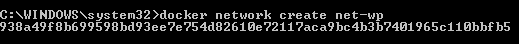
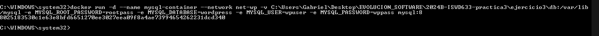
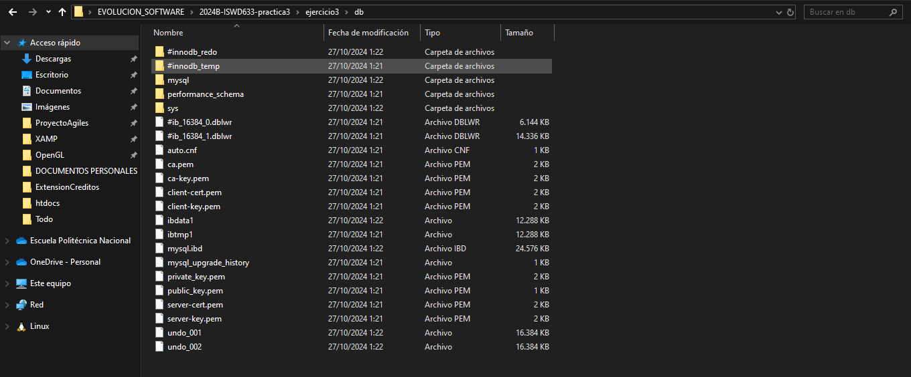
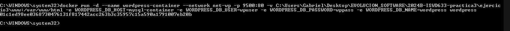
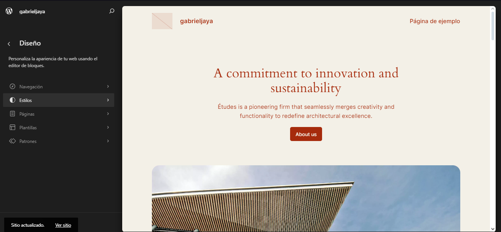
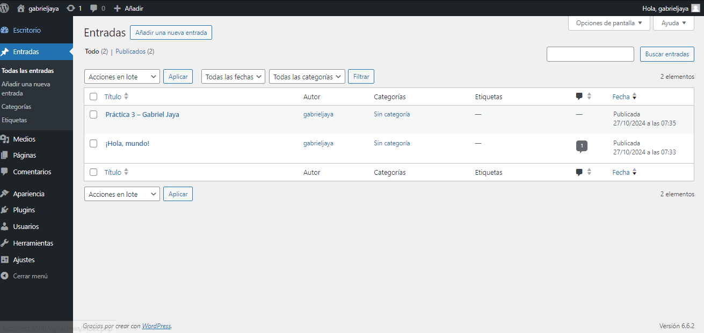
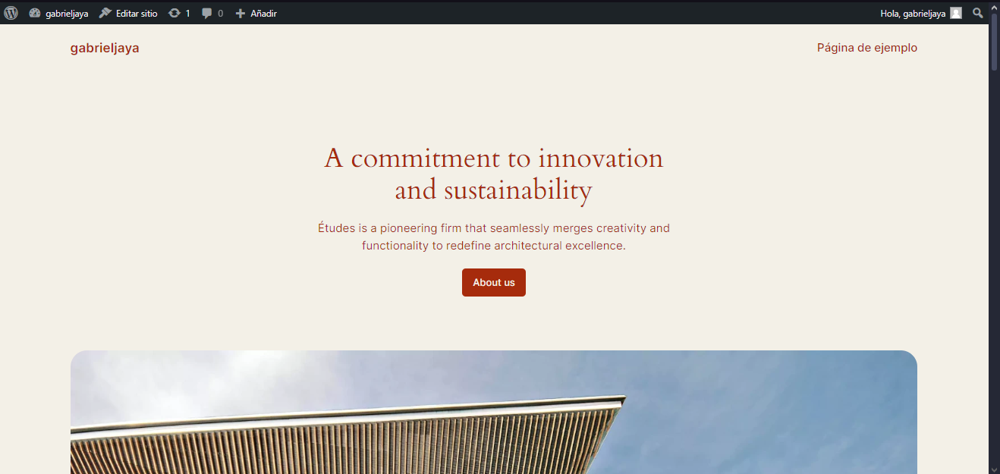

## Esquema para el ejercicio


### Crear red net-wp
```
docker network create net-wp 
```

### Para que persista la información es necesario conocer en dónde mysql almacena la información.

En el esquema del ejercicio carpeta del contenedor (a) es /var/lib/mysql.

Ruta carpeta host: .../ejercicio3/db

### ¿Qué contiene la carpeta db del host?
tos que MySQL guarda. Inicialmente está vacía, pero después de crear el contenedor, contendrá los archivos de la base de datos.

### Crear un contenedor con la imagen mysql:8  en la red net-wp, configurar las variables de entorno: MYSQL_ROOT_PASSWORD, MYSQL_DATABASE, MYSQL_USER y MYSQL_PASSWORD
```
docker run -d --name mysql-container --network net-wp -v C:\Users\Gabriel\Desktop\EVOLUCION_SOFTWARE\2024B-ISWD633-practica3\ejercicio3\db:/var/lib/mysql -e MYSQL_ROOT_PASSWORD=rootpass -e MYSQL_DATABASE=wordpress -e MYSQL_USER=wpuser -e MYSQL_PASSWORD=wppass mysql:8
```


### ¿Qué observa en la carpeta db que se encontraba inicialmente vacía?
Ahora contiene archivos y directorios que representan las bases de datos MySQL, incluyendo archivos de configuración y datos almacenados.



### Para que persista la información es necesario conocer en dónde wordpress almacena la información.

En el esquema del ejercicio la carpeta del contenedor (b) es /var/www/html

Ruta carpeta host: .../ejercicio3/www

### Crear un contenedor con la imagen wordpress en la red net-wp, configurar las variables de entorno WORDPRESS_DB_HOST, WORDPRESS_DB_USER, WORDPRESS_DB_PASSWORD y WORDPRESS_DB_NAME (los valores de estas variables corresponden a los del contenedor creado previamente)
```
docker run -d --name wordpress-container --network net-wp -p 9500:80 -v C:\Users\Gabriel\Desktop\EVOLUCION_SOFTWARE\2024B-ISWD633-practica3\ejercicio3\www:/var/www/html -e WORDPRESS_DB_HOST=mysql-container -e WORDPRESS_DB_USER=wpuser -e WORDPRESS_DB_PASSWORD=wppass -e WORDPRESS_DB_NAME=wordpress wordpress
```


### Personalizar la apariencia de wordpress y agregar una entrada



### Eliminar el contenedor y crearlo nuevamente, ¿qué ha sucedido?

Al eliminar y volver a crear el contenedor, las personalizaciones y entradas añadidas persisten. Esto sucede porque los volúmenes aseguran que los datos se almacenen fuera del contenedor, lo que permite la persistencia.




